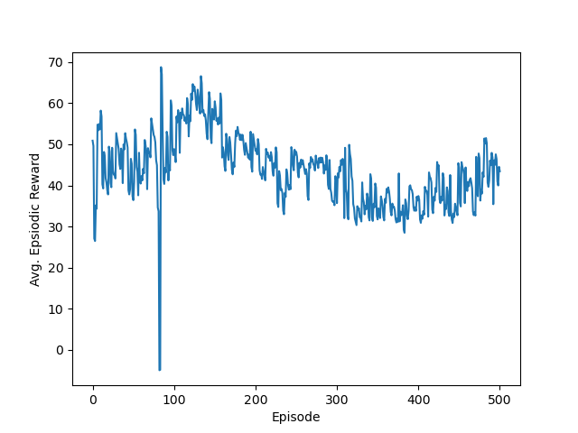

# Adversarial RL robot soccer
Author: Muye Jia

* under development, this README serves as a debug log and updates.

## Update
1. The ROS training loop now uses DDPG to train one robot attacker; it has seen decent result after only 500 episodes.
2. Next step might be respawning the robot at random starting position to train a more general dribbling strategy.
3. Gradient clipping and input normalization are applied since one major problem during training is that the gradient will explode and results in the player always chooses to go in extreme directions. For the same reason, rewards are generally given small numeric values.
4. The following shows the rewards plot after 500 episodes.

* Note: The rewards are set as follows:
    - If scored, rewards += 20.0
    - If dead ball, rewards -= 0.1
    - If dribble towards the goal, rewards += 0.5
    - If dribble away from the goal, rewards -= 0.1
    - If the player can "see" the goal, rewards += 0.5