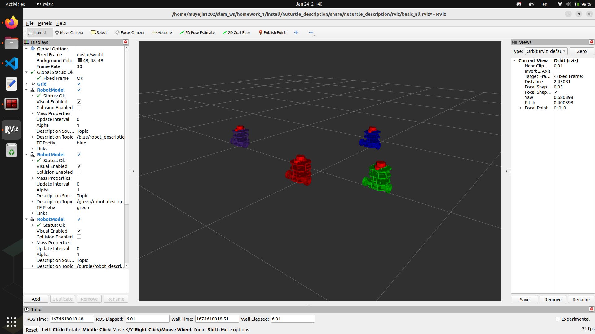

# Nuturtle  Description
URDF files for Nuturtle SomeBot
* `ros2 launch nuturtle_description load_one.launch.py` to see the robot in rviz.
* `ros2 launch nuturtle_description load_all.launch` to see four copies of the robot in rviz.

* The rqt_graph when all four robots are visualized (Nodes Only, Hide Debug) is:

# Launch File Details
* `ros2 launch nuturtle_description load_all.launch.py --show-arguments`
  
  Arguments (pass arguments as '<name>:=<value>'):

    'use_jsp':
        determine how to publish joint states. Valid choices are: ['true', 'false']
        (default: 'true')

    'use_rviz':
        determine whether to use rviz. Valid choices are: ['true', 'false']
        (default: 'true')

    'world_frame':
        name of the world frame
        (default: 'nusim/world')

    'xpos':
        robot starting x position
        (default: '0')

    'ypos':
        robot starting y position
        (default: '0')

    'zpos':
        robot starting z position
        (default: '0')

    'robot_color':
        determine the robot color. Valid choices are: ['purple', 'red', 'green', 'blue', '']
        (default: 'purple')

* `ros2 launch nuturtle_description load_one.launch --show-arguments`
  
  Arguments (pass arguments as '<name>:=<value>'):
    
    'use_jsp':
        determine how to publish joint states. Valid choices are: ['true', 'false']
        (default: 'true')

    'use_rviz':
        determine whether to use rviz. Valid choices are: ['true', 'false']
        (default: 'true')

    'world_frame':
        name of the world frame
        (default: 'nusim/world')

    'xpos':
        robot starting x position
        (default: '0')

    'ypos':
        robot starting y position
        (default: '0')

    'zpos':
        robot starting z position
        (default: '0')

    'robot_color':
        determine the robot color. Valid choices are: ['purple', 'red', 'green', 'blue', '']
        (default: 'purple')

Worked With Dilan, James, Marno, Shantao